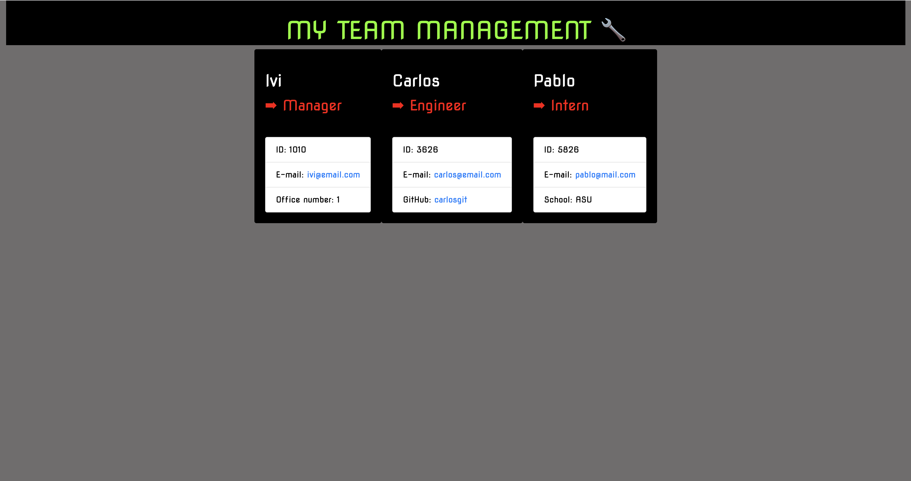

# TEAM PROFILE GENERATOR
  

  <h2>Table of Contents</h2>
  
  * [Description](#description)
  * [Usage](#usage)
  * [Screenshots](#scrs)
  * [Link to the live site](#live)
  * [Questions](#questions)
  

## Description

This is a Node.js command-line application that takes users inputs about employees on a software engineering team and generates an HTML webpage that displays summaries for each person. The generated file is located in the folder "dist" and it's called index.html.

## Usage
  
To run the application, please run the command line: "npm install" or "npm i" followed by the command "npm start"

To test to check if the code is running smoothly, please use the command line: npm test
 

## Screenshots 
<table>
<tr>
<td></td>
<tr>
<td></td>
<tr>
<td></td>
</tr>
</tr>
</table>
 

## Link to the live site

 
GitHub Repository: <a href="https://ibarros19.github.io/" target="_blank">https://ibarros19.github.io/</a> 
 
Video Demo: <a href="https://ibarros19.github.io/" target="_blank">https://ibarros19.github.io/</a> 

## Questions
If you have any further questions, please feel free to contact me on GitHub at [ivibarros19](https://github.com/ivibarros19) or by email at [ivibarros19@gmail.com](ivibarros19@gmail.com).
